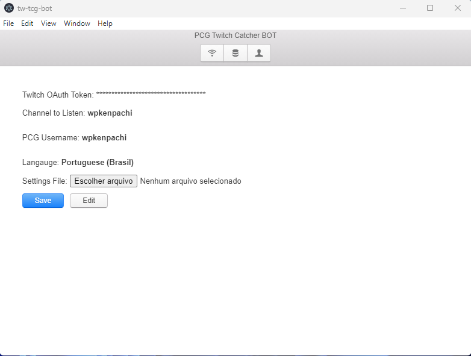
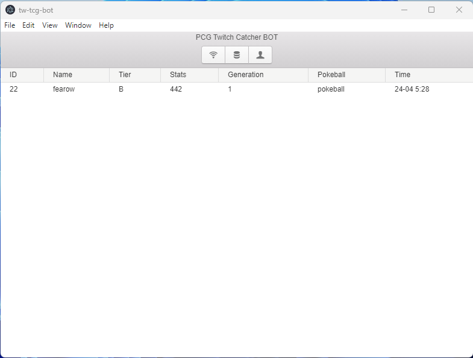
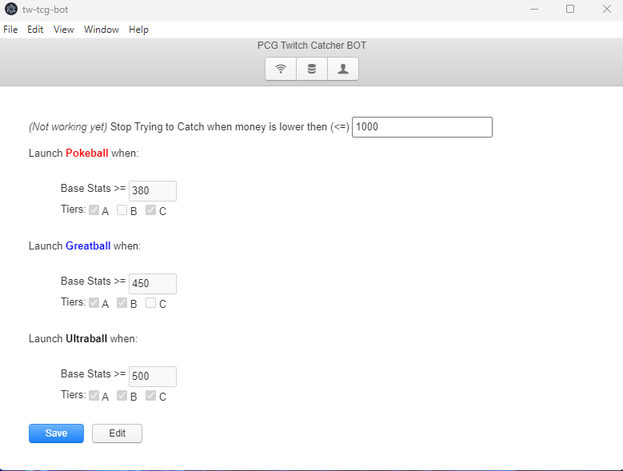

# Versao do BOT pro TCG com GUI

# A primeira coisa a se fazer
Baixar o arquivo .zip da release...
Só procurar o nome Release em algum lugar dessa pagina pra lá -->>>
Obs: Ou me pedir no whisper ou no chat do jorge


# Segunda coisa a se fazer
Montar o seu arquivo settings.json
Ele deve se parecer com este do codigo ali abaixo, so que vc vai mudar algumas coisas

- A primeira coisa que vc vai mudar é o TWITCH_OAUTH_TOKEN.
Voce vai precisar ir neste site aqui: https://twitchapps.com/tmi/
- Autenticar sua conta da twitch, e ele vai gerar um TOKEN igual este do codigo abaixo (`oauth:ulmx....`).
- Voce copia o que foi gerado pelo site e coloque no lugar deste ali embaixo.

<b>
**LEMBRANDO**

Voce vai copiar isto que esta aqui embaixo,
e vai colar num arquivo que vc vai criar, com o nome de settings.json e colocar em qualquer lugar ai do teu pc (Poe na pasta do release que tu baixou q fica mais facil)
</b>

settiings.json
```json
{
  "TWITCH_OAUTH_TOKEN": "oauth:dkpaceh16uirjk5x6b2raf88jg83131",
  "CHANNEL_TO_LISTEN": "backupjorge",
  "PCG_USER": "PokemonCommunityGame",
  "CHANNEL_LANG": "ptbr",
  "SPAWN_MESSAGES": [
    {
      "name": "default",
      "active": true,
      "ptbr": "(?<=TwitchLit\\sum|uma)\\s(?=\\S*['-\\.])?([a-zA-Zà-úÀ-Ú0-9'-\\.]+)",
      "eng": "(?<=TwitchLit\\sa\\swild\\s)(?=\\S*['-\\.])?([a-zA-Zà-úÀ-Ú0-9'-\\.]+)"
    },
    {
      "name": "fish_event",
      "active": true,
      "ptbr": "(?<=deemon8FishRed\\sum|uma)\\s(?=\\S*['-\\.])?([a-zA-Zà-úÀ-Ú0-9'-\\.]+)",
      "eng": "(?<=deemon8FishRed\\sa\\swild\\s)(?=\\S*['-\\.])?([a-zA-Zà-úÀ-Ú0-9'-\\.]+)"
    }
  ]
}

```

# Utilizaçao

## Aba de configuraçao (settings.json)

Esta aba se abre ao clicar no BOTAO DO MEIO ALI (o que parecem 3 waffles empilhados)

Aqui vc vai clicar em escolher arquivo, e vai selecionar o seu arquivo setting.json
que vc acabou de configurar.
Depois é só clicar em save, e pronto. O bot ta conectado a conta.

OBS: Se vc clicar em edit, as suas configuracoes ficam a vista, pra vc modificar na mao. E depois e so clicar em save (Eu recomendo modificar direto no arquivo settings.json, fechar o programa, abrir novamente subir o arquivo e dar um save)




## Aba de visualizaçao

Esta é a primeira aba, que tem um icone de sinal de wifi (n achei melhor fodase)

Aqui vc apenas ve quando algum pokemon aparece. Ele vai mostrar o pokemon.
Nome, Tier, Stats, Geraçao, A pokebola que o programa usou e o horario que ele apareceu. E só isso mesmo. 

Obs: Se vc fechar o programa, toda essa tabela é limpa. A lista de pokemons que
apareceram fica vazia novamente.




## Aba de preferencias

Esta é a ultima aba. 

Esta aqui é novidade. A primeira opcao ainda nao ta funcionando (COMO TA ESCRITO Not working yet)

Aqui vc decide as suas preferencias. Por exemplo, posso configurar pra que o bot
lance uma pokebola todas as vezes que um pokemon Tier B ou C apareça, caso ele tenha
BASE STATS maior ou igual a 350. E assim vai...

Uma coisa importante de lembrar, é que o programa começa a testar qual pokeball ele vai lançar, a partir da ultraball. Assim a logica funciona bem...
Entao ele so precisa verificar acima de qual stats e quais os tiers a pokebola 
__XPTO__ vai ser lançada. A configuraçao padrao foi a que achei melhor deixar.

Lembrando que assim que terminar suas configuracoes, aperte em ___SAVE___



# Instalando e configurando


# Consideracoes finais
Eu vou estar melhorando algumas coisas de layout e talz,
e lançando novas releases com funcionalidades novas.
